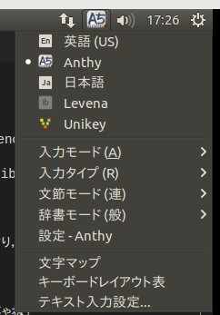

このドキュメントでは，ibusのgui関係，特にpreferenceとプロパティについて説明する．

# about preferences

ibus-setupで設定ボタンを開くとime独自の設定画面が開かれるはず．これがpreference．

このことからguiを実際に作るのは分かるがどこで設定をするのか分からなかったがアレはibusのメインエンジンとは独立して作ることができる．

mozc.xmlやcanna.xmlなどのengineセクションにnameセクションがある．

ibus-setup-"nameセクションの名前"というプログラムを独自で(エンジンとは別に)作り，それを/usr/lib\*/に置く．

/usr/lib\*というのは例えば/usr/lib/ibus/ibus-setup-XXXのような感じ．

自分はここに置いといたら動いたし他のエンジンもここに置いているのでまぁここでいいんじゃね？

実際にconfig組むのはgtkでやる．

e.g.

levena.xmlではengine以下nameセクションでは`ibus-levena`となっている．

この場合は/usr/lib/ibus/ibus-setup-ibus-levenaとする．

まぁconfigはそっち側でibus.hでも呼び出してconfig service使えば良さそう．

んでengine側ではibus起動時にibusconfig的なの読み出しておk．

# about ibus-prop

まず，propとかproplistがあるわけだがこれはこの部分.



この画像の入力モードとか入力タイプとかね．なかなかに分かり辛い．

そしてpropはこの一つ一つの要素．

prop_listはこの枠全体的な概念．

proplistをまず作り，それらのpropを一つ一つ追加して，そいつをibusに登録することで始めて使えるようになる．

ところでこいつ，変な作り方したらかなり苦労した．

ibusXXXengineにprop\_list用のメンバ追加して，そこに`ibus_prop_list_new();`する

その後propを作って

```
        if (ibus_prop_list_update_property(levena->proplist, prop) == FALSE)
            ibus_prop_list_append(levena->proplist, prop);
```

で追加して最後に`ibus_engine_register_properties(klass,klass->proplist);`で出来た．